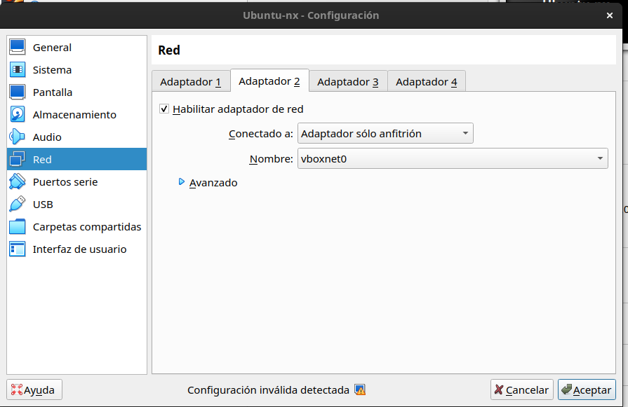
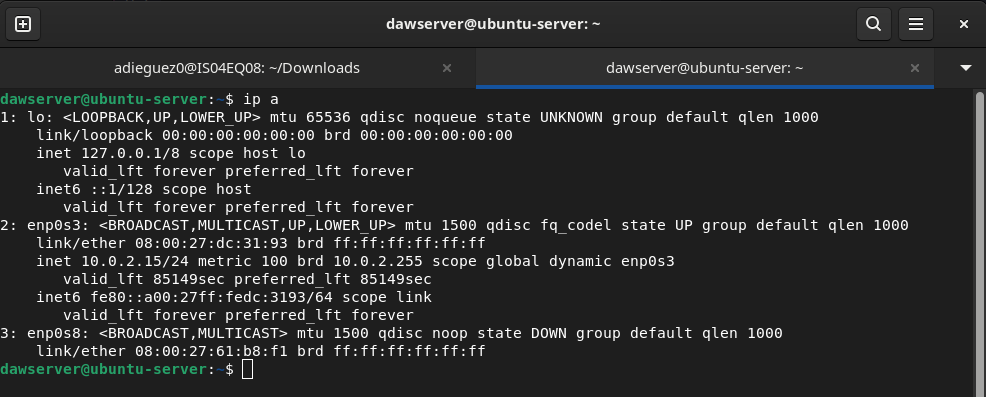
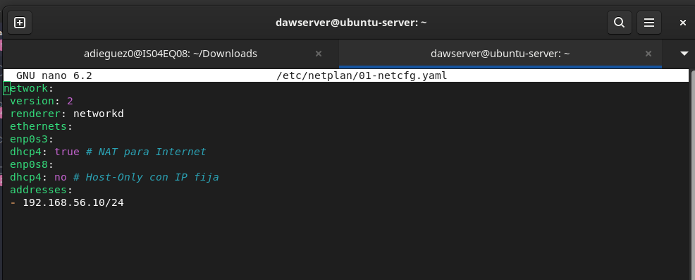
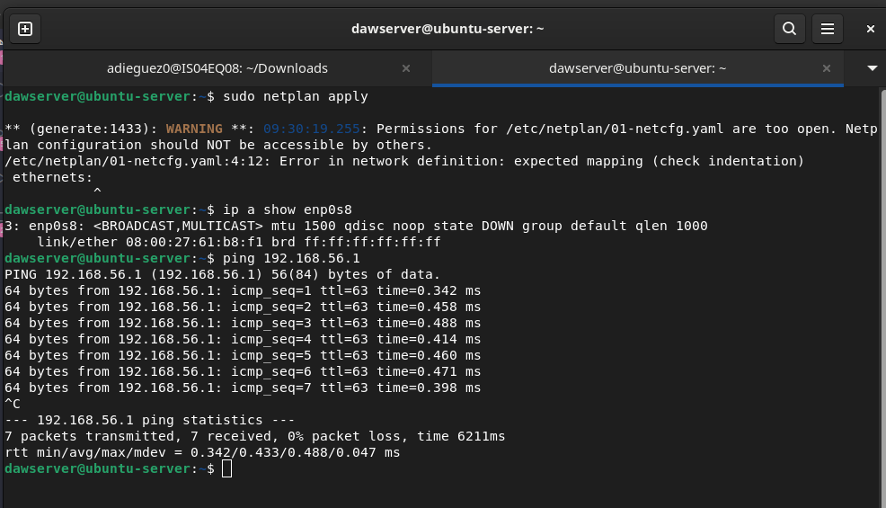

# Actividad 3.2: Seguridad en Nginx - Autenticación, Control de Acceso y HTTPS

## Configuracion de la VM
1. Adaptador 1 (NAT - Internet):

2. Adaptador 2 (Host-Only - Testing)

3. Configuración de Red en Ubuntu

4. Contenido de /etc/netplan/01-netcfg.yaml

5. Aplicar configuración:

6.  Verificar desde Windows
